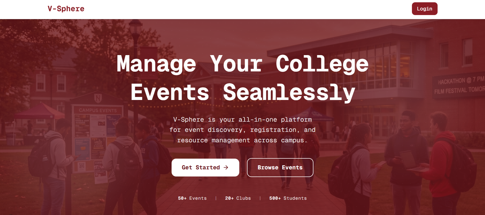
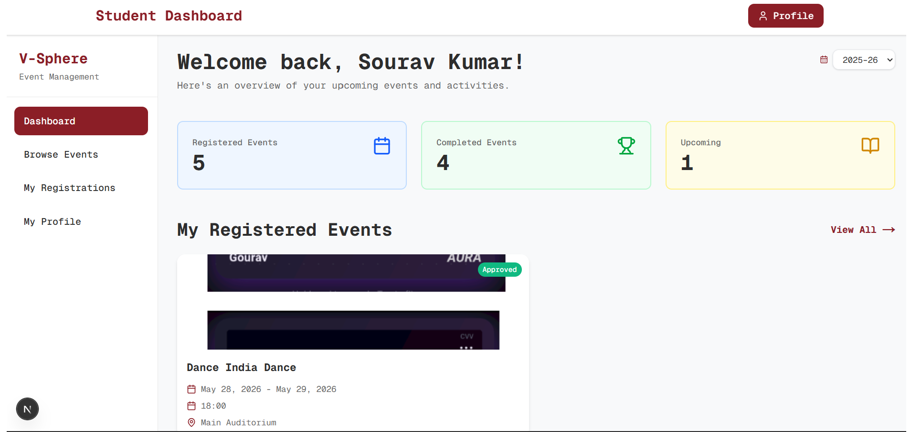
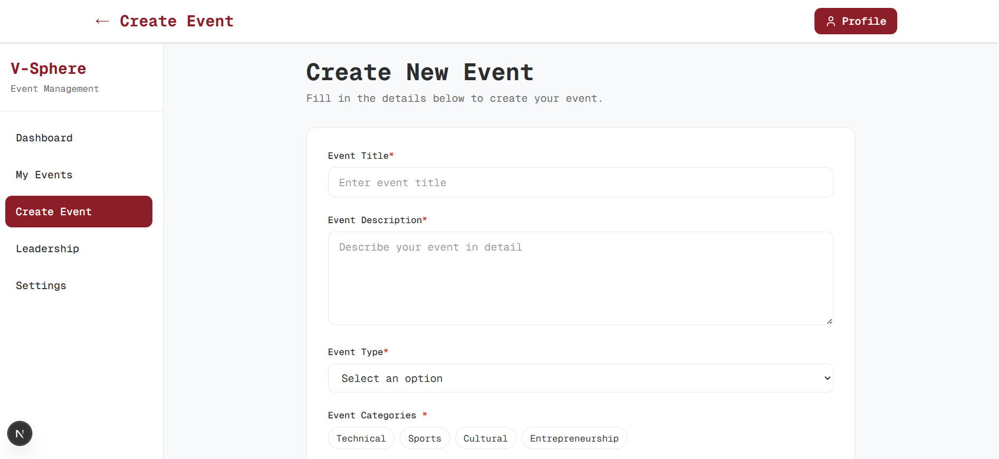
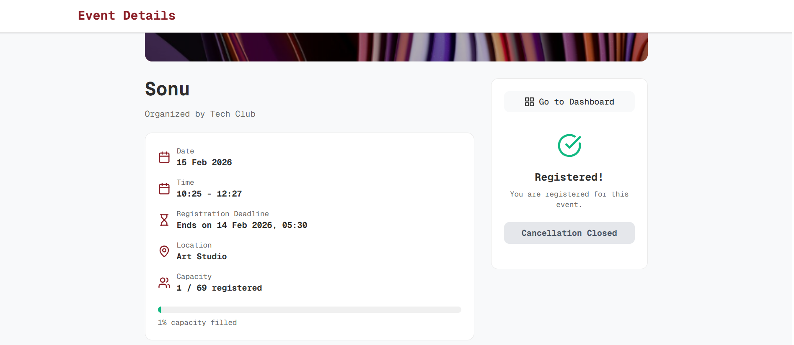

# V-Sphere 🎓

 <!-- Replace with your actual banner if different -->

**V-Sphere** is a comprehensive College Event & Resource Management Platform designed to streamline campus life. It provides a centralized hub where students, clubs, and administrators can seamlessly interact, organize, and track events.

---

## 🎯 What Problem Does It Solve?

Organizing college events traditionally involves a disjointed mix of spreadsheets, fragmented communication channels, and manual approval processes. This leads to scheduling conflicts, lost data, and poor student participation. 

**V-Sphere** eliminates this friction by offering a unified, glossy, and highly interactive interface that handles everything from venue allocation and club approvals to student registrations and team formations. It brings transparency and efficiency to campus event management.

---

## ✨ Key Features

- **Role-Based Access Control (RBAC):** Dedicated dashboards and permissions for **Admins**, **Clubs/Faculty**, and **Students**.
- **Seamless Event Discovery:** Students can easily browse, filter, and register for upcoming events.
- **Secure Team Formation:** Implements a unique **Consent Code** system, ensuring students can only be added to a team with their explicit permission.
- **Resource & Venue Management:** Admins can allocate and manage campus venues effortlessly, preventing double-booking.
- **Modern, Responsive UI:** Built with Tailwind CSS and Framer Motion for a premium, dynamic, and engaging user experience.
- **Automated Health Checks:** Integrated cron jobs to ensure the database remains active and highly available.

---

## 📸 Screenshots

*Include your project screenshots below to showcase the UI.*

### Homepage & Hero Section
 <!-- Add your screenshot here -->

### Student Dashboard & Event Browsing
 <!-- Add your screenshot here -->

### Club Event Creation
 <!-- Add your screenshot here -->

### Secure Team Registration (Consent Codes)
 <!-- Add your screenshot here -->

---

## 🛠️ Tech Stack & Key Decisions

- **Framework:** [Next.js (App Router)](https://nextjs.org/) - Chosen for its robust Server-Side Rendering (SSR) capabilities, seamless API route integration, and optimal performance.
- **Language:** TypeScript - Ensures type safety, reduces runtime errors, and improves developer experience across the complex data models.
- **Database:** [MongoDB](https://www.mongodb.com/) & Mongoose - Selected for its flexible, document-oriented structure, which perfectly accommodates varying event types, custom fields, and dynamic team sizes.
- **Styling:** [Tailwind CSS](https://tailwindcss.com/) - Allowed for rapid UI iteration, enabling the creation of a glossy, pure black theme and modern aesthetics without writing cumbersome CSS files.
- **Animations:** [Framer Motion](https://www.framer.com/motion/) - Used to add micro-interactions and smooth transitions, making the platform feel alive and responsive.
- **Icons:** Lucide React.

---

## 🧗 Challenges Faced & Solutions

1. **Secure Team Registrations:** 
   * **Challenge:** Preventing users from arbitrarily registering other students into teams without their consent.
   * **Solution:** Developed a dynamic, cryptographic "Consent Code" generation system. A team leader must physically or digitally obtain this unique code from their peers to successfully add them to a team roster.
2. **Database Idle Timeouts:** 
   * **Challenge:** Free-tier MongoDB Atlas clusters automatically pause after 60 minutes of inactivity, causing high latency on the next request.
   * **Solution:** Implemented a lightweight `/api/health` endpoint coupled with a Vercel Cron Job that pings the database every 10 minutes, ensuring the cluster never sleeps.
3. **Complex State & Role Management:** 
   * **Challenge:** Delivering distinctly different user experiences and data boundaries for Admins, Clubs, and Students within the same application.
   * **Solution:** Created a robust custom JWT-based authentication flow paired with modular Next.js layouts, ensuring secure routing and tailored UI components based on the active session.

---

## 🚀 Getting Started

### Prerequisites
- Node.js (v18 or higher)
- MongoDB Cluster (Atlas or local)

### Installation

1. **Clone the repository:**
   ```bash
   git clone https://github.com/gourav05052004/v-sphere.git
   cd v-sphere
   ```

2. **Install dependencies:**
   ```bash
   npm install
   ```

3. **Set up Environment Variables:**
   Create a `.env.local` file in the root directory and add the following variables:
   ```env
   MONGODB_URI=your_mongodb_connection_string
   JWT_SECRET=your_jwt_secret_key
   HEALTH_SECRET=your_optional_health_cron_secret
   ```

4. **Run the development server:**
   ```bash
   npm run dev
   ```

5. **Open the app:**
   Navigate to [http://localhost:3000](http://localhost:3000) in your browser.

---

## 👨‍💻 Author

**Made by [Gourav Kumar Sonu](https://github.com/gourav05052004)**
